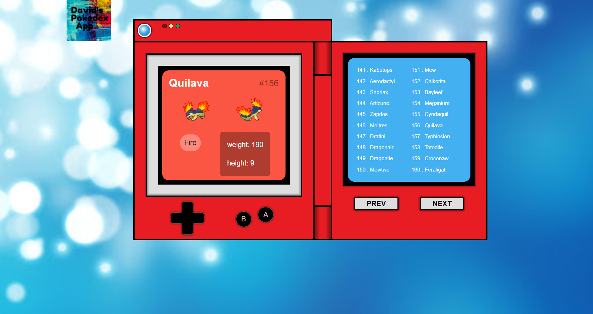

# Pokedex

This is my Pokemon Pokedex app. A Pokedex allows Pokemon fans to display the Pokemon that they have collected. Users can find stats on their favorite pokemon. All 800+ can be found in this application.I did this project because I knew that there was a Pokemon API and wanted to do a fun, cool project with it. I also wanted more practice with Javascript and API calls. I want to thank Justin Kim for his tutorial because it was very helpful.

# Environment Setup
1. Clone my repo at https://github.com/davidmstanleyjr/Pokedex
2. CD into it and click "run in default browser" from the index.html file.

# Technologies Used
1. HTML
2. CSS
3. Javascript
4. Pokeapi
5. Favicon.io
6. Media queries

# Issues

The biggest problem I had was the for loop that iterates through the list items that starts on line 57. I've always had problems with for loops and I needed the practice. 

I also had an issue with mobile responsiveness. The handheld console would become very distorted when viewing it on my mobile phone. I solved this by including a media query that changed the height and width of the Pokedex when viewing the app on a smaller screen.

# Screenshots

# Live Page

Here is a link to the deployed site https://davidmstanleyjr.github.io/Pokedex/

